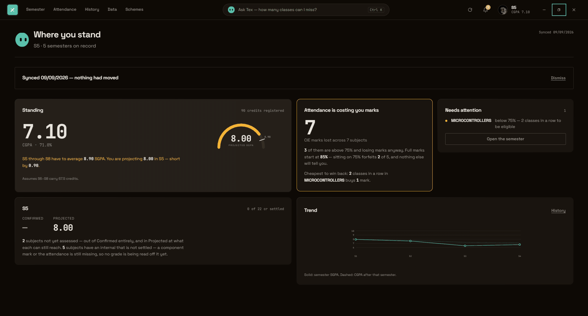

# TargetX

**Every other KTU tool tells you what you already scored. TargetX tells you the
mark you still need.**

Not a calculator. A desktop app with three ways into one record:

| | |
|---|---|
| **Semester** | every mark you have, and what you still need in each paper |
| **Attendance** | day by day, what you can still miss, and what it is costing you |
| **Tex** | ask any of it in your own words, and see the working behind the answer |

**If your college runs etlab, it works for you.** Attendance, marks, timetable
and the day-by-day record are read from whatever your portal publishes. The
target and internal-marks arithmetic follows **KTU Regulations 2024**, so a 2024
scheme student gets everything; on an older scheme the tracking still works and
you pick your own course types.

> ### 0.4.0 is the last release built on etlab sync
>
> Not because it broke — it works better than it ever has. It is the last one
> because to keep going I would need someone to pay for it, and the only people
> who could are colleges, who are never going to buy software that signs into
> their portal with their students' passwords. They would be right to refuse.
> And it can be switched off any afternoon by someone who has never heard of me.
>
> **Nothing is taken away from you.** This build keeps working for as long as
> your portal does. See [what happens next](#what-happens-next).

---



---

## The thing no other tool shows you

Under Regulations 2024, attendance is not only an eligibility gate — it is a
**scored component of your internal marks**, worth up to 5 of them in every
subject, in bands (R 7.5.ii):

| Attendance | CIE marks earned |
|---|---|
| 85% and above | **5** |
| 80–84% | 4 |
| 75–79% | 3 |
| 70–74% | 2 |
| 60–69% | 1 |
| below 60% | 0 |

So a student sitting comfortably above the 75% line is still **forfeiting
marks, in every subject, quietly, all semester**. No portal shows this. Nothing
else computes it. TargetX totals it across your subjects and tells you the
cheapest way to win a mark back — usually a specific number of consecutive
classes in one specific subject.

And below 60% the door shuts: R 6.2 lets the Principal condone attendance under
75% only as far as 60%. Below that the exam cannot be sat, and attending from
there on does not change it. TargetX says so on the day it becomes true, not
after results.

## What else it does

- **The mark you need, per subject.** Both pass conditions, not one — the
  separate **40% ESE minimum** as well as the combined total. Spreadsheets miss
  the first, which is how a subject that "looked passed" comes back as a
  supplementary. A `*` beside a required mark means the ESE cutoff is what is
  binding, not the aggregate.
- **How many classes you can still miss.** From real attended-over-held counts,
  with duty leave credited the way R 6.3.ii actually caps it — at 10% of classes
  held, which grows as you spend it. Answered as a number of classes.
- **The cheapest route to your CGPA.** Name a target; TargetX works backwards to
  the SGPA each remaining semester must carry, then to which subject is cheapest
  to push and how far — balanced so the plan is one a person can attempt, rather
  than four subjects at 95.
- **Your marks in without typing them.** Sign in to your college's etlab portal
  and it pulls every semester, attendance, series marks, grades and published
  SGPA in one pass.
- **Ask it in words.** Press `Ctrl K` and ask — *"can I skip tomorrow?"*, *"what
  do I need to pass CN?"*, *"what is condonation?"*. **Tex** answers in the box
  rather than dropping you on a screen to work it out. Every figure in the reply
  is computed locally by the engine, so the answers are the same numbers the
  rest of the app shows, and most questions never touch the network at all.
- **Updates arrive on their own.** The app offers a new version a few seconds
  after launch. It never installs unasked, and a failed check is silent — being
  offline is not an error a student needs to see.

Two SGPA figures are shown on purpose. **Confirmed** counts only subjects with a
real ESE mark. **Projected** assumes you hit your target where it is reachable,
and the best grade still mathematically available where it is not.

## Getting your data in

Four routes, strongest first. All four converge on **one** tolerant parser, so
it is the same tested code path whichever you use.

1. **Sync etlab** — live login. Enter the portal URL, username and password.
   The client discovers rather than assumes: it probes candidate login routes,
   picks the form scoring highest, harvests every hidden input (so Yii1
   `YII_CSRF_TOKEN` and Yii2 `_csrf` both work), and only accepts a page if
   course codes actually appear in it.
2. **KTU grade card** — past semesters into a real CGPA. KTU's own portal is
   captcha- and OTP-gated, so TargetX does **not** script a login there. It
   parses the card you already download, then recomputes each SGPA and **flags
   any semester where its figure disagrees with the printed one** — a mismatch
   means a row was misread, and you get told instead of quietly getting a wrong
   CGPA.
3. **Public page URL** — for college pages with no login.
4. **Paste a table** — the universal fallback. Works when a portal has a
   captcha, a VPN, or markup nobody predicted.

> **Will it work at your college?** Sync has been proved against one college's
> etlab so far. You can check yours **without giving anyone an account**: save
> your academics page from a browser you are already signed in to, and drop the
> file onto **Data -> "Will sync work at my college?"**. The page never leaves
> your machine; what the app offers you to send back is a separate block of
> table shapes with every digit blanked out.

## Privacy

Your marks, attendance and CGPA never leave the machine. The app makes network
requests in exactly four situations: the portal sign-in you asked for, the
course-catalogue file, the update check, and — only if you sign in and only when
you ask a question the app could not answer by itself — the question box. All
four are named and located in the
[privacy statement](https://codedrichy.github.io/TargetX/privacy.html)
([`PRIVACY.md`](PRIVACY.md)).

The fourth one is new in 0.3.0 and is the only one that involves a server of
ours, so it is worth being exact about. What is sent is the question you typed
and the code and title of the subjects you are registered for. What is **not**
sent is every number: no marks, no attendance, no CGPA, no name, no register
number. What comes back is not an answer — it is a destination, drawn from a
fixed list of five screens and your own subjects, and it is rejected outright if
it names anything else. Every figure you then read was computed on your machine
by the same engine as the rest of the app. Sign-in gates that box and nothing
else; signed out, the app is fully usable and the box still answers everything
it can answer locally, which is most things.

Your portal password is used once, to sign in. It is never written to disk,
never logged, never included in an export. That is enforced by a test, not by
intention: `credential-containment.test.ts` puts a sentinel password through a
whole sync and searches for it by value in every outbound request, the saved
record, the export, and the text of a failed sync's error message.

## Licence

Source-available under the **Business Source License 1.1** ([`LICENSE`](LICENSE)).

- **Students: free, forever.** One person tracking their own coursework pays
  nothing and needs no permission. That grant is in the licence text, not
  offered as a policy that could be withdrawn.
- **Institutions: commercial licence required.** Any deployment by or on behalf
  of a college needs a separate agreement.
- **It becomes Apache-2.0 on 2030-08-29.** Fixed, and in the licence text.

The source is public because the central claim — that your marks never leave
your machine — is one you should be able to check rather than take on trust.
There are four places to check and no others: `app/src-tauri/src/etlab.rs` and
`ktu.rs` carry the portal transports, `app/src/sync/update.ts` the update check,
and `app/src/state/ask.ts` the question box — which is the only one that talks
to a server of ours, and the only file that decides what is put in that request.
The Worker on the other end is in `worker/`, and `worker/src/schema.ts` is the
type its reply has to parse into before the app will act on it. That argument
cannot be made from a closed repository, which is why this is source-available
rather than proprietary, and why it is not permissive. Not open source under the
OSI definition, and not described as such.

Third-party components ship under their own terms
([`THIRD-PARTY-NOTICES.md`](THIRD-PARTY-NOTICES.md)). No external pull request
will be merged until a contributor licence agreement exists — merging one
without it would make the project jointly owned and end the relicensing option
silently.

---
---

# For developers

Everything above is the product. Everything below is the repository.

## Building from source

```
cd app
npm install
npm run tauri dev      # desktop window
npm run dev            # or just the frontend in a browser
npm run tauri build    # installers into src-tauri/target/release/bundle
```

The retired Python original is kept in `legacy/` as the parity oracle for the
calculation core. It is not part of the shipped app.

## Tests

```
cd app && npm test        # 794
cd worker && npm test     # 75
```

**869 tests across 71 files**, counted from a run on 2026-09-02, not estimated:
257 engine, 237 UI, 180 state, 102 sync, 16 styles, 2 data, and 75 in the
Worker.

`engine/__tests__/parity.test.ts` is the load-bearing one. It replays a frozen
corpus of generated course cases and semester rollups produced by the Python
original, and the corpus file has been byte-identical through eighteen
refactors — so a change that alters a single computed figure anywhere in the
engine fails immediately, by name. CI re-checks that the corpus itself has not
been edited, because regenerating it to make a test pass is the one way this
suite could be defeated without anything going red.

Other things that are checked rather than claimed: colour contrast
(`styles/__tests__/contrast.test.ts`), keyboard reachability (`npm run
keyboard`), layout overflow at real laptop sizes (`npm run measure`), and the
download page at four widths in both themes (`npm run site`).

## The 2024 rules, as implemented

**Grade bands** (`total` = CIE + ESE, out of 100):

| Grade | Range | GP | | Grade | Range | GP |
|---|---|---|---|---|---|---|
| S | 90–100 | 10 | | C+ | 65–69 | 7.0 |
| A+ | 85–89 | 9.0 | | C | 60–64 | 6.5 |
| A | 80–84 | 8.5 | | D | 55–59 | 6.0 |
| B+ | 75–79 | 8.0 | | P | 50–54 | 5.5 |
| B | 70–74 | 7.5 | | F | <50 **or** ESE below cutoff | 0 |

**Two independent pass conditions — both must hold:**

1. `CIE + ESE >= 50`
2. `ESE >= 40%` of the ESE maximum -> **24/60** or **20/50** or **10/25**

**Course patterns** (per subject, switchable in the grid):

| Type | CIE | ESE | ESE cutoff |
|---|---|---|---|
| `TH 40/60` | 40 | 60 | 24 |
| `TH 50/50` | 50 | 50 | 20 |
| `LAB 75/25` | 75 | 25 | 10 |
| `PRJ 100/0` | 100 | — | n/a |

`SGPA = sum(credit x gradepoint) / sum(credit)` · `CGPA` = credit-weighted
across locked semesters · `Percentage = 10 x CGPA`.

Attendance: below **75%** flags `SHORTAGE`; below **60%** — the R 6.2
condonation floor — flags `DEBARRED`.

## What happens next

I built this because of one number.

I was at 76% attendance and thought I was fine — everyone says 75 is the line.
Then I read Regulations 2024 properly and found R 7.5.ii: attendance is not just
the eligibility gate, it is worth **five internal marks**, in bands. At 76% I had
already given two of them away. In every subject. All semester. Nothing had told
me — not the portal, not any calculator.

That annoyed me enough to build this, and then it turned into 862 tests, because
once you are the thing telling people what they need to score, approximately
right is not good enough.

**Why this is the last sync release.** To keep working on it I would need someone
to pay for it, and the only people who could are colleges. No college is going to
buy software that logs into their portal with their students' passwords — they
would be right to refuse, and I would refuse too. And the whole thing can be
switched off on any ordinary afternoon by someone at etlab who has never heard of
me. That is not a foundation to build a decade on, and I would rather say so than
let this repo go quiet and leave people to work it out.

**Where I am going instead.** The questions I have started caring about are on the
far side of that wall anyway:

- which students are about to lose exam eligibility, while there is still time
- what a whole class is struggling with, not just me
- whether the internal marks a college submits to KTU are even correct

None of that is reachable from one student's login. So I am going to build it
properly — with a college's own data and its own permission, instead of around
them. The regulation engine in this repository is the part that took longest and
is tested hardest, and it is the part that comes with me.

**You lose nothing.** This build keeps working for as long as your portal does.
Free, on your own machine, written into the licence rather than promised — so it
was never something I could quietly take back.

**Still tell me if a number is wrong.** A figure that disagrees with your portal
is still a bug, and the engine it lives in is the one I am carrying forward.
Reporting it now helps the next thing too.

And thank you, genuinely. Every issue anyone opened made this better — two of
them ([#12](https://github.com/CodedRichy/TargetX/issues/12),
[#13](https://github.com/CodedRichy/TargetX/issues/13)) are fixed in this exact
release. Someone took the time to write those, and it mattered.

— Rishi, still a KTU student, still checking his own attendance in this thing

## Why this exists — what the existing tools get wrong

| Prior art | Failure |
|---|---|
| Entri / typical web KTU calculators | Still on the 2019 model. Some apply the legacy `(10 x CGPA) - 2.5` conversion; the 2024 scheme is **`% = 10 x CGPA`**, full stop. |
| Old GitHub CGPA repos (2014 / 2019 schemes) | Carry the retired **Low Pass (LP)** grade and its grade point. Under 2024 there is no LP band. |
| Mobile grade apps | Ask only for the final **letter grade** per subject. They cannot see a semester in progress, which is the only time a prediction is worth anything. |
| Spreadsheets | Model the aggregate `CIE + ESE >= 50` but silently ignore the **separate 40% ESE minimum** — the exact case where a student with 38/40 internal is told "you only need 12" and then fails on the cutoff. |
| All of them | No attendance-to-marks model, no target engine, no persistence. |

## Course catalogue

Presets load from **`curriculum.json`** — data, not code. KTU revises codes
between admission batches, so correct the file once for your batch and it stays
corrected. The app refreshes it from this repository on launch, which means a
curriculum revision does not need a new build.

```json
["PCCST302", "Data Structures and Algorithms", 4, "TH 40/60"]
```

KTU sets the **first year by group, not by branch** — page 1 of the 2024
curriculum sorts every B.Tech branch into four groups and prints one first-year
table per group — so the catalogue is keyed the same way. **31 branches across
Group A (computer and information science) and Group B (electrical science)
carry S1 and S2**; Computer Science and Engineering is transcribed in full and
carries S1 to S8. Everything after the first year is per-branch and arrives one
PDF at a time, which the picker says on screen rather than letting a student
seed another branch's subjects at another branch's credits.

S1 and S2 carry KTU's first-year **slots** — Physics or Chemistry, Health and
Wellness or Life Skills, plus a third in Group B S2 — as a choice rather than as
fixed subjects, because a student takes one of each in S1 and the other in S2 in
an order the institution sets. Groups C (physical science) and D (life science)
are not transcribed.

## Layout

| Path | Role |
|---|---|
| `app/src/engine/` | Calculation core (`evaluate`, `requiredEse`, `summarise`, `goals`, `targets`) |
| `app/src/sync/etlab.ts` | Authenticated etlab client, over a Rust transport |
| `app/src/sync/gradecard.ts` | Grade-card and public-page parsers |
| `app/src-tauri/src/etlab.rs` | Cookie jar and HTTP. In memory only, never a file |
| `app/src/data/curriculum.json` | Bundled course catalogue, refreshable from the repo |
| `app/src/state/persist.ts` | Your data, saved atomically with three backups kept |
| `app/src/sync/update.ts` | The update check. Never blocks startup, never installs unasked |
| `app/src/state/answers.ts` | Tex's answers. Every figure computed here, from the engine |
| `app/src/state/glossary.ts` | What the words mean. A lookup table, not a model |
| `worker/` | The question router. Names a screen and a subject; never a number |
| `docs/` | The download page, served by GitHub Pages |
| `legacy/` | The retired Python original, kept as the parity oracle |

Built on **Tauri 2** with a **SolidJS** frontend and a **TypeScript** engine — a
single binary with no Python at runtime. `PORT_PLAN.md` has the full reasoning,
including the alternatives that were rejected and why.

## Other documents

[`CHANGELOG.md`](CHANGELOG.md) is written for the student deciding whether an
update is worth taking; its first section is the numbers that used to be wrong.
[`DEPLOYMENT.md`](DEPLOYMENT.md) answers "what does this touch?" for a college
IT department — silent-install flags, the five hosts it contacts, where the
record lives, and how to take version control away from the updater.
[`SIGNING.md`](SIGNING.md) covers releasing and the two signatures a build
carries. [`ACCESSIBILITY.md`](ACCESSIBILITY.md) is a dated self-assessment
against WCAG 2.1 AA, including what is still short.
